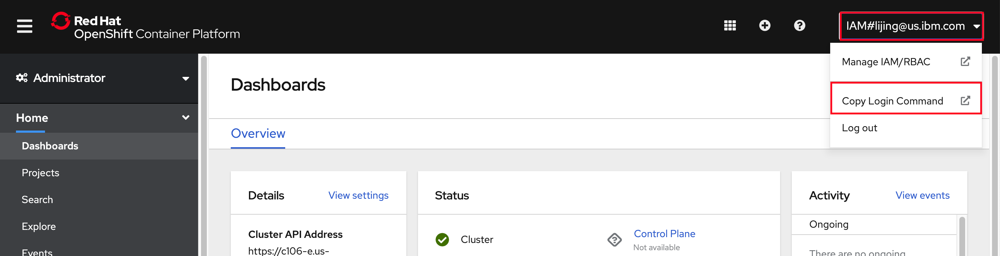

# OpenShift Service Mesh Lab

## Section 1 - Setting up your lab environment

You must already have an OpenShift cluster in order to complete the lab. Your cluster must have **3 or more worker nodes** with at least **4 cores and 16GB RAM** and run OpenShift 4.6 or greater.

### Access your cluster

In order to complete the lab, you will need to access to your OpenShift cluster from your terminal. 

### Login to IBM Cloud

To login to IBM Cloud,

1. Go to [https://cloud.ibm.com](https://cloud.ibm.com) in your browser and login.

1. Make sure that you are in the correct account#.

    

>Note: you may not have access to your OpenShift cluster if you are not in the right account#.

### Shell

Most of the labs are run using CLI commands.

The IBM Cloud Shell available at [https://shell.cloud.ibm.com](https://shell.cloud.ibm.com) is preconfigured with the full IBM Cloud CLI and tons of plug-ins and tools that you can use to manage apps, resources, and infrastructure.

### Login to OpenShift

1. In a new browser tab, go to [https://cloud.ibm.com/kubernetes/clusters?platformType=openshift](https://cloud.ibm.com/kubernetes/clusters?platformType=openshift).

1. Make sure the account holding the cluster is selected,

1. Select your cluster instance and open it.

1. Click `OpenShift web console` button on the top.

    

1. Click on your username in the upper right and select `Copy Login Command` option.

    

1. Click the `Display Token` link.

    

1. Copy the contents of the field `Log in with this token` to the clipboard. It provides a login command with a valid token for your username.

    

1. Go to the your shell terminal.

1. Paste the `oc login command` in the IBM Cloud Shell terminal and run it.

### Clone the lab repo

1. From your command line, run:

    ```shell
    export WORK_DIR=$(pwd)

    git clone -b openshift-service-mesh https://github.com/odrodrig/istio101

    ```

    This is the working directory for the workshop. You will use the example `.yaml` files that are located in the `docs/plans` directory in the following exercises.

## Section 2 - Installing OpenShift Service Mesh on OpenShift

In this module, you will install the OpenShift Service Mesh operator and then use that oprator to install the Istio control plane. 

Before we install of OpenShift Service Mesh operator, there are a few prerequisite installations we need to do first. These operators need to be installed in the following order:

- OpenShift Elasticsearch Operator
- OpenShift Jaegar Operator
- OpenShift Kiali Operator
- OpenShift Service Mesh Operator

It's important that you install the operators that are supplied by `Red Hat` and not the `community` versions.

1. Navigate to your OpenShift Console in your browser and navigate to the `Operators` -> `OperatorHub` section from the navigation tabs on the left side of the page.

    

1. Then search for OpenShift Elasticsearch Operator and select the following option:

    

    - Then select the `stable-5.2` update channel and accept the rest of the default values.

    - Click `Install`

    - The Operator will take a few seconds to install but you can move on while it is installing.

1. Next, go back to the OperatorHub page and search for `openshift jaeger` and click on the `Red Hat OpenShift Jaeger` operator.

    

    - Select the `stable` update channel and accept the rest of the default values

    - Click `Install`

    - The Operator will take a few seconds to install but you can move on while it is installing.

1. Then, go back to the OperatorHub page and search for `kiali` and click on the `kiali` operator. Ensure it is the one that says `Provided by Red Hat`

    

    - Select the `stable` update channel and accept the rest of the default values

    - Click `Install`

    - The Operator will take a few seconds to install but you can move on while it is installing.

1. Lastly, go back to the OperatorHub page and search for `service mesh` and select the `Red Hat OpenShift Service Mesh` operator.

    

    - Select the `stable` update channel and accept the rest of the default values

    - Click `Install`

    - The Operator will take a few seconds to install but you can move on while it is installing.

    With the necessary operators installed, now we can create the Istio control plane.

1. Create a new project in which we will install the Istio control plane. In your terminal environment, run the following command:

    ```bash
    oc new-project istio-system
    ```

1. While you are in the terminal, create the guestbook project if it doesn't exist already.

    ```bash
    oc new-project guestbook
    ```

1. From the OpenShift console, navigate to the `Operators` -> `Installed Operators` page.

    

1. Change into the `istio-system` project by using the `Project` dropdown at the upper left side of the page. Then, select the `Red Hat OpenShift Service Mesh` operator:

    

1. On the next page, select the tab for `Istio Service Mesh Control Plane` and click on the blue `Create ServiceMeshControlPlane` button. 

    

    - Accept all of the defaults and click on the blue `Create` button at the bottom of the page.

1. Next, select the `Istio Service Mesh Member Roll` tab and click on the blue `Create ServiceMeshMemberRoll` button. This member roll will tell the Istio control plane which projects to monitor.

    

    - On the next page select the option to configure via yaml view

    - In the yaml editor change the `spec.members` list to contain only the `guestbook` project as seen below:

        

    - When done, click `create`

1. Before you continue you will need to ensure that the Service Mesh Control Plane is ready. Run the following command to view the status:

    ```bash
    oc get smcp -n istio-system
    ```

    You should see the following when it is ready.

    ```bash
    NAME    READY   STATUS            PROFILES      VERSION   AGE
    basic   9/9     ComponentsReady   ["default"]   2.0.7.1   3m19s
    ```

With the installation of the Istio Control Plane done we can move on to installing the guestbook application.

## Section 3 - Deploy the Guestbook app with Istio Proxy

The Guestbook app is a sample app for users to leave comments. It consists of a web front end, Redis master for storage, and a replicated set of Redis slaves. 


### Download the Guestbook app

1. Clone the Guestbook app into the `workshop` directory.

    ```shell
    cd $WORK_DIR
    git clone -b openshift-service-mesh https://github.com/odrodrig/guestbook.git
    ```

1. Navigate into the app directory.

    ```shell
    cd guestbook/v2
    ```

### Enable the automatic sidecar injection

In Kubernetes, a sidecar is a utility container in the pod, and its purpose is to support the main container. For Istio to work, Envoy proxies must be deployed as sidecars to each pod of the deployment. In Istio on Kubernetes it is possible to enable automatic sidecar injection for all pods in a namespace, however, in OpenShift with OpenShift Service Mesh this is not possible. Instead, you must enable sidecar injection for each deployment. This is so temporary workloads like build containers do not get a sidecar. Enabling sidecar injection in a deployment can be done with a simple annotation in the deployment object.

1. For each deployment that you want to enable sidecar injection with, you will need to add the annotation `sidecar.istio.io/inject: "true"` to the deployment object. For the purposes of this workshop, this has already been done for the guestbook and redis deployments. Run the following command to view the guestbook deployment and the sidecar injection annotation:

    ```bash
    cat $WORK_DIR/guestbook/v2/guestbook-deployment.yaml
    ```
    
    You should see the following:

    ```yaml
    apiVersion: apps/v1
    kind: Deployment
    metadata:
        name: guestbook-v2
        labels:
            app: guestbook
            version: "2.0"
    spec:
        selector:
            matchLabels:
                app: guestbook
        replicas: 3
        template:
            metadata:
                labels:
                    app: guestbook
                    version: "2.0"   
                annotations:
                    sidecar.istio.io/inject: "true"
            spec:
                containers:
                - name: guestbook
                    image: ibmcom/guestbook:v2
                    resources:
                        requests:
                            cpu: 100m
                            memory: 100Mi
                    ports:
                    - name: http
                    containerPort: 3000
    ```

    Notice the `sidecar.istio.io/inject: "true"` annotation at `spec.template.metadata.annotations`.

### Create a Redis database

The Redis database is a service that you can use to persist the data of your app. The Redis database comes with a master and slave modules. This is the datastore used by the guestbook application.

1. Create the Redis deployments and services for both the master and the slave.

    ``` shell
    oc create -f $WORK_DIR/guestbook/v2/redis-master-deployment.yaml
    oc create -f $WORK_DIR/guestbook/v2/redis-master-service.yaml
    oc create -f $WORK_DIR/guestbook/v2/redis-slave-deployment.yaml
    oc create -f $WORK_DIR/guestbook/v2/redis-slave-service.yaml
    ```

1. Verify that the Redis deployments for the master and the slave are created.

    ```shell
    oc get deployment
    ```

    Output:

    ```shell
    NAME           READY   UP-TO-DATE   AVAILABLE   AGE
    redis-master   1/1     1            1           2m16s
    redis-slave    2/2     2            2           2m15s
    ```

1. Verify that the Redis services for the master and the slave are created.

    ```shell
    oc get svc
    ```

    Output:

    ```shell
    NAME           TYPE           CLUSTER-IP      EXTERNAL-IP     PORT(S)        AGE
    redis-master   ClusterIP      172.21.85.39    <none>          6379/TCP       5d
    redis-slave    ClusterIP      172.21.205.35   <none>          6379/TCP       5d
    ```

1. Verify that the Redis pods for the master and the slave are up and running.

    ```shell
    oc get pods
    ```

    Output:

    ```shell
    NAME                            READY     STATUS    RESTARTS   AGE
    redis-master-4sswq              2/2       Running   0          5d
    redis-slave-kj8jp               2/2       Running   0          5d
    redis-slave-nslps               2/2       Running   0          5d
    ```

### Install the Guestbook app

1. Deploy the Guestbook app on to the OpenShift cluster. Deploy both the v1 and v2 versions of the app:

    ```shell
    oc apply -f $WORK_DIR/guestbook/v1/guestbook-deployment.yaml
    oc apply -f $WORK_DIR/guestbook/v2/guestbook-deployment.yaml
    ```

    These commands deploy the Guestbook app on to the OpenShift cluster. Since we enabled automation sidecar injection, these pods will be also include an Envoy sidecar as they are started in the cluster. Here we have two versions of deployments, a new version (`v2`) in the current directory, and a previous version (`v1`) in a sibling directory. They will be used in future sections to showcase the Istio traffic routing capabilities.

1. Create the guestbook service.

    ```shell
    oc create -f $WORK_DIR/guestbook/v2/guestbook-service.yaml
    ```

1. Verify that the service was created.

    ```shell
    oc get svc
    ```

    Output:

    ```shell
    NAME           TYPE           CLUSTER-IP      EXTERNAL-IP     PORT(S)        AGE
    guestbook      LoadBalancer   172.21.36.181   169.61.37.140   80:32149/TCP   5d
    ...
    ```

1. Verify that the pods are up and running.

    ```shell
    oc get pods
    ```

    Sample output:

    ```shell
    NAME                            READY   STATUS    RESTARTS   AGE
    guestbook-v1-98dd9c654-dz8dq    2/2     Running   0          30s
    guestbook-v1-98dd9c654-mgfv6    2/2     Running   0          30s
    guestbook-v1-98dd9c654-x8gxx    2/2     Running   0          30s
    guestbook-v2-8689f6c559-5ntgv   2/2     Running   0          28s
    guestbook-v2-8689f6c559-fpzb7   2/2     Running   0          28s
    guestbook-v2-8689f6c559-wqbnl   2/2     Running   0          28s
    redis-master-577bc6fbb-zh5v8    2/2     Running   0          4m47s
    redis-slave-7779c6f75b-bshvs    2/2     Running   0          4m46s
    redis-slave-7779c6f75b-nvsd6    2/2     Running   0          4m46s
    ```

    Note that each guestbook pod has 2 containers in it. One is the guestbook container, and the other is the Envoy proxy sidecar.

## Section 4 - Expose the service mesh with the Istio Ingress Gateway

The components deployed on the service mesh by default are not exposed outside the cluster. External access to individual services so far has been provided by creating an external load balancer or node port on each service.

An Ingress Gateway resource can be created to allow external requests through the Istio Ingress Gateway to the backing services. When using OpenShift Service Mesh, a route is automatically created when a new Istio Gateway is detected.

### Expose the Guestbook app with Ingress Gateway

1. Configure the guestbook default route with the Istio Ingress Gateway. The `guestbook-gateway.yaml` file is in this repository (istio101) in the `docs/plans` directory.

    ```shell
    oc create -f $WORK_DIR/istio101/docs/plans/guestbook-gateway.yaml
    ```

1. Get the OpenShift route that is automatically created.

    ```shell
    GUESTBOOK_ROUTE=$(oc get route -n istio-system  -o=jsonpath='{.items[1].spec.host}')

    echo $GUESTBOOK_ROUTE
    ```

    You should see something like the following:

    

1. You can navigate to your deployed guestbook application by copying the route printed out in the previous command and pasting it in a new browser tab.

Congrats you have exposed your service externally using an Istio Gateway and an OpenShift route. Continue on to see how you can use Istio to manage traffic between two different application versions.

## Section 5 - Perform traffic management

### Using rules to manage traffic

The core component used for traffic management in Istio is Pilot, which manages and configures all the Envoy proxy instances deployed in a particular Istio service mesh. It lets you specify what rules you want to use to route traffic between Envoy proxies, which run as sidecars to each service in the mesh. Each service consists of any number of instances running on pods, containers, VMs etc. Each service can have any number of versions (a.k.a. subsets). There can be distinct subsets of service instances running different variants of the app binary. These variants are not necessarily different API versions. They could be iterative changes to the same service, deployed in different environments (prod, staging, dev, etc.). Pilot translates high-level rules into low-level configurations and distributes this config to Envoy instances. Pilot uses three types of configuration resources to manage traffic within its service mesh: Virtual Services, Destination Rules, and Service Entries.

#### Virtual Services

A [VirtualService](https://istio.io/latest/docs/reference/config/networking/virtual-service/#VirtualService) defines a set of traffic routing rules to apply when a host is addressed. Each routing rule defines matching criteria for traffic of a specific protocol. If the traffic is matched, then it is sent to a named [destination](https://istio.io/latest/docs/reference/config/networking/destination-rule/#DestinationRule) service (or [subset](https://istio.io/latest/docs/reference/config/networking/destination-rule/#Subset) or version of it) defined in the service registry.

#### Destination Rules

A [DestinationRule](https://istio.io/latest/docs/reference/config/networking/destination-rule/#DestinationRule) defines policies that apply to traffic intended for a service after routing has occurred. These rules specify configuration for load balancing, connection pool size from the sidecar, and outlier detection settings to detect and evict unhealthy hosts from the load balancing pool. Any destination `host` and `subset` referenced in a `VirtualService` rule must be defined in a corresponding `DestinationRule`.

#### Service Entries

A [ServiceEntry](https://istio.io/latest/docs/reference/config/networking/service-entry/#ServiceEntry) configuration enables services within the mesh to access a service not necessarily managed by Istio. The rule describes the endpoints, ports and protocols of a white-listed set of mesh-external domains and IP blocks that services in the mesh are allowed to access.

### The Guestbook app

In the Guestbook app, there is one service: guestbook. The guestbook service has two distinct versions: the base version (version 1) and the modernized version (version 2). Each version of the service has three instances based on the number of replicas in [guestbook-deployment.yaml](https://github.com/odrodrig/guestbook/blob/openshift-service-mesh/v1/guestbook-deployment.yaml) and v2 [guestbook-deployment.yaml](https://github.com/odrodrig/guestbook/blob/openshift-service-mesh/v2/guestbook-deployment.yaml). By default, prior to creating any rules, Istio will route requests equally across version 1 and version 2 of the guestbook service and their respective instances in a round robin manner. However, new versions of a service can easily introduce bugs to the service mesh, so following A/B Testing and Canary Deployments is good practice.

#### A/B testing with Istio

A/B testing is a method of performing identical tests against two separate service versions in order to determine which performs better. To prevent Istio from performing the default routing behavior between the original and modernized guestbook service, define the following rules (found in [istio101/docs/plans](https://github.com/odrodrig/istio101/tree/openshift-service-mesh/docs/plans)):

```shell
oc create -f $WORK_DIR/istio101/docs/plans/guestbook-destination.yaml
```

Let's examine the rule:

```yaml
apiVersion: networking.istio.io/v1beta1
kind: DestinationRule
metadata:
  name: destination-rule-guestbook
spec:
  host: guestbook
  subsets:
    - name: v1
      labels:
        version: '1.0'
    - name: v2
      labels:
        version: '2.0'
```

Next, apply the VirtualService

```shell
oc replace -f $WORK_DIR/istio101/docs/plans/virtualservice-all-v1.yaml
```

Let's examine the rule:

```yaml
apiVersion: networking.istio.io/v1beta1
kind: VirtualService
metadata:
  name: virtual-service-guestbook
spec:
  hosts:
    - '*'
  gateways:
    - guestbook-gateway
  http:
    - route:
        - destination:
            host: guestbook
            subset: v1
```

The `VirtualService` defines a rule that captures all HTTP traffic coming in through the Istio ingress gateway, `guestbook-gateway`, and routes 100% of the traffic to pods of the guestbook service with label "version: v1". A subset or version of a route destination is identified with a reference to a named service subset which must be declared in a corresponding `DestinationRule`. Since there are three instances matching the criteria of hostname `guestbook` and subset `version: v1`, by default Envoy will send traffic to all three instances in a round robin manner.

View the guestbook application using the `$GUESTBOOK_ROUTE` specified in [Exercise 5](../exercise-5/README.md) and enter it as a URL in Firefox or Chrome web browsers. You can use the echo command to get this value, if you don't remember it.

```shell
echo $GUESTBOOK_ROUTE
```

To enable the Istio service mesh for A/B testing against the new service version, modify the original `VirtualService` rule:

```shell
oc replace -f $WORK_DIR/istio101/docs/plans/virtualservice-test.yaml
```

Let's examine the rule:

```yaml
apiVersion: networking.istio.io/v1beta1
kind: VirtualService
metadata:
  name: virtual-service-guestbook
spec:
  hosts:
    - '*'
  gateways:
    - guestbook-gateway
  http:
    - match:
        - headers:
            user-agent:
              regex: '.*Firefox.*'
      route:
        - destination:
            host: guestbook
            subset: v2
    - route:
        - destination:
            host: guestbook
            subset: v1
```


In Istio `VirtualService` rules, there can be only one rule for each service and therefore when defining multiple [HTTPRoute](https://istio.io/latest/docs/reference/config/networking/virtual-service/#HTTPRoute) blocks, the order in which they are defined in the yaml matters. Hence, the original `VirtualService` rule is modified rather than creating a new rule. With the modified rule, incoming requests originating from `Firefox` browsers will go to the newer version of guestbook. All other requests fall-through to the next block, which routes all traffic to the original version of guestbook.

Try opening up your route in a Firefox browser and then try it again with a different browser such as Chrome.

#### Canary deployment

In `Canary Deployments`, newer versions of services are incrementally rolled out to users to minimize the risk and impact of any bugs introduced by the newer version. To begin incrementally routing traffic to the newer version of the guestbook service, modify the original `VirtualService` rule:

```shell
oc replace -f $WORK_DIR/istio101/docs/plans/virtualservice-80-20.yaml
```

Let's examine the rule:

```yaml
apiVersion: networking.istio.io/v1beta1
kind: VirtualService
metadata:
  name: virtual-service-guestbook
spec:
  hosts:
    - '*'
  gateways:
    - guestbook-gateway
  http:
    - route:
        - destination:
            host: guestbook
            subset: v1
          weight: 80
        - destination:
            host: guestbook
            subset: v2
          weight: 20
```

In the modified rule, the routed traffic is split between two different subsets of the guestbook service. In this manner, traffic to the modernized version 2 of guestbook is controlled on a percentage basis to limit the impact of any unforeseen bugs. This rule can be modified over time until eventually all traffic is directed to the newer version of the service.

View the guestbook application using the `$GUESTBOOK_ROUTE` specified in [Exercise 5](../exercise-5/README.md) and enter it as a URL in Firefox or Chrome web browsers. **Ensure that you are using a hard refresh (command + Shift + R on Mac or Ctrl + F5 on windows) to remove any browser caching.** You should notice that the guestbook should swap between V1 or V2 at about the weight you specified.

#### Route all traffic to v2

For the following exercises, we'll be working with Guestbook v2. Route all traffic to guestbook v2 with a new VirtualService rule:

  ```bash
  oc apply -f $WORK_DIR/istio101/docs/plans/virtualservice-all-v2.yaml
  ```

  This is what that rule looks like:

  ```yaml
  apiVersion: networking.istio.io/v1beta1
  kind: VirtualService
  metadata:
    name: virtual-service-guestbook
  spec:
    hosts:
      - '*'
    gateways:
      - guestbook-gateway
    http:
      - route:
          - destination:
              host: guestbook
              subset: v2
  ```

#### Implementing circuit breakers with destination rules

Istio `DestinationRules` allow users to configure Envoy's implementation of [circuit breakers](https://www.envoyproxy.io/docs/envoy/latest/intro/arch_overview/upstream/circuit_breaking.html?highlight=circuit). Circuit breakers are critical for defining the behavior for service-to-service communication in the service mesh. In the event of a failure for a particular service, circuit breakers allow users to set global defaults for failure recovery on a per service and/or per service version basis. Users can apply a [traffic policy](https://istio.io/latest/docs/reference/config/networking/destination-rule/#TrafficPolicy) at the top level of the `DestinationRule` to create circuit breaker settings for an entire service, or it can be defined at the subset level to create settings for a particular version of a service.

Depending on whether a service handles [HTTP](https://istio.io/latest/docs/reference/config/networking/destination-rule/#ConnectionPoolSettings-HTTPSettings) requests or [TCP](https://istio.io/latest/docs/reference/config/networking/destination-rule/#ConnectionPoolSettings-TCPSettings) connections, `DestinationRules` expose a number of ways for Envoy to limit traffic to a particular service as well as define failure recovery behavior for services initiating the connection to an unhealthy service.

### Further reading

* [Istio Concept](https://istio.io/latest/docs/concepts/traffic-management/)
* [Istio Rules API](https://istio.io/latest/docs/reference/config/)
* [Istio Proxy Debug Tool](https://istio.io/latest/docs/reference/commands/istioctl/#istioctl-proxy-config)
* [Traffic Management](https://blog.openshift.com/istio-traffic-management-diving-deeper/)
* [Circuit Breaking](https://blog.openshift.com/microservices-patterns-envoy-part-i/)
* [Timeouts and Retries](https://blog.openshift.com/microservices-patterns-envoy-proxy-part-ii-timeouts-retries/)

## Section 6 - Secure your services

### Mutual authentication with Transport Layer Security (mTLS)

Istio can secure the communication between microservices without requiring application code changes. Security is provided by authenticating and encrypting communication paths within the cluster. This is becoming a common security and compliance requirement. Delegating communication security to Istio (as opposed to implementing TLS in each microservice), ensures that your application will be deployed with consistent and manageable security policies.

Istio Citadel is an optional part of Istio's control plane components. When enabled, it provides each Envoy sidecar proxy with a strong (cryptographic) identity, in the form of a certificate.
Identity is based on the microservice's service account and is independent of its specific network location, such as cluster or current IP address.
Envoys then use the certificates to identify each other and establish an authenticated and encrypted communication channel between them.

Citadel is responsible for:

* Providing each service with an identity representing its role.

* Providing a common trust root to allow Envoys to validate and authenticate each other.

* Providing a key management system, automating generation, distribution, and rotation of certificates and keys.

When an application microservice connects to another microservice, the communication is redirected through the client side and server side Envoys. The end-to-end communication path is:

* Local TCP connection (i.e., `localhost`, not reaching the "wire") between the application and Envoy (client- and server-side);

* Mutually authenticated and encrypted connection between Envoy proxies.

When Envoy proxies establish a connection, they exchange and validate certificates to confirm that each is indeed connected to a valid and expected peer. The established identities can later be used as basis for policy checks (e.g., access authorization).

### Enforce mTLS between all Istio services

1. To enforce a mesh-wide authentication policy that requires mutual TLS, submit the following policy. This policy specifies that all workloads in the mesh will only accept encrypted requests using TLS.

    Apply the following `PeerAuthentication` object to enforce mTLS between the services.

    ```bash
    oc apply -f $WORK_DIR/istio101/docs/plans/guestbook-mtls.yaml
    ```

    ```yaml
    apiVersion: "security.istio.io/v1beta1"
    kind: "PeerAuthentication"
    metadata:
    name: "default"
    namespace: "istio-system"
    spec:
    mtls:
        mode: STRICT
    ```

    And with that, your services are now communicating securely with each other via mutual TLS.

### Further Reading

* [Basic TLS/SSL Terminology](https://dzone.com/articles/tlsssl-terminology-and-basics)

* [TLS Handshake Explained](https://www.ibm.com/support/knowledgecenter/en/SSFKSJ_7.1.0/com.ibm.mq.doc/sy10660_.htm)

* [Istio Task](https://istio.io/latest/docs/tasks/security/)

* [Istio Concept](https://istio.io/docs/concepts/security/mutual-tls.html)
