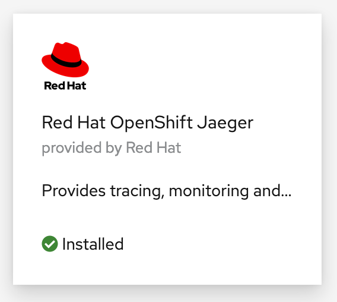
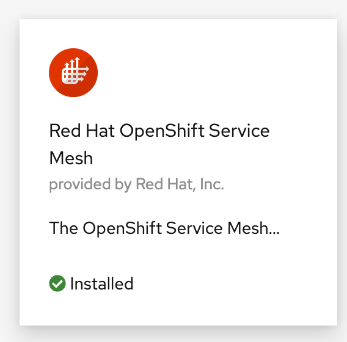
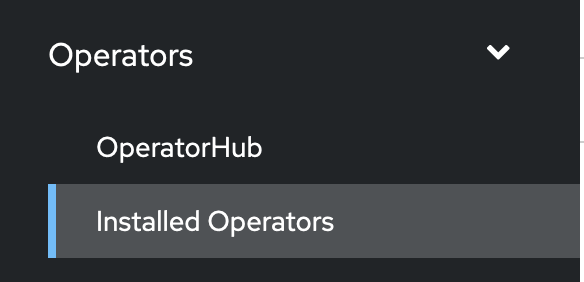

# Exercise 2 - Installing OpenShift Service Mesh on OpenShift

In this module, you will install the OpenShift Service Mesh operator and then use that oprator to install the Istio control plane. 

Before we install of OpenShift Service Mesh operator, there are a few prerequisite installations we need to do first. These operators need to be installed in the following order:

- OpenShift Elasticsearch Operator
- OpenShift Jaegar Operator
- OpenShift Kiali Operator
- OpenShift Service Mesh Operator

It's important that you install the operators that are supplied by `Red Hat` and not the `community` versions.

1. Navigate to your OpenShift Console in your browser and navigate to the `Operators` -> `OperatorHub` section from the navigation tabs on the left side of the page.

    

1. Then search for OpenShift Elasticsearch Operator and select the following option:

    

    - Then select the `stable-5.2` update channel and accept the rest of the default values.

    - Click `Install`

    - The Operator will take a few seconds to install but you can move on while it is installing.

1. Next, go back to the OperatorHub page and search for `openshift jaeger` and click on the `Red Hat OpenShift Jaeger` operator.

    

    - Select the `stable` update channel and accept the rest of the default values

    - Click `Install`

    - The Operator will take a few seconds to install but you can move on while it is installing.

1. Then, go back to the OperatorHub page and search for `kiali` and click on the `kiali` operator. Ensure it is the one that says `Provided by Red Hat`

    

    - Select the `stable` update channel and accept the rest of the default values

    - Click `Install`

    - The Operator will take a few seconds to install but you can move on while it is installing.

1. Lastly, go back to the OperatorHub page and search for `service mesh` and select the `Red Hat OpenShift Service Mesh` operator.

    

    - Select the `stable` update channel and accept the rest of the default values

    - Click `Install`

    - The Operator will take a few seconds to install but you can move on while it is installing.

    With the necessary operators installed, now we can create the Istio control plane.

1. Create a new project in which we will install the Istio control plane. In your terminal environment, run the following command:

    ```bash
    oc new-project istio-system
    ```

1. While you are in the terminal, create the guestbook project if it doesn't exist already.

    ```bash
    oc new-project guestbook
    ```

1. From the OpenShift console, navigate to the `Operators` -> `Installed Operators` page.

    

1. Change into the `istio-system` project by using the `Project` dropdown at the upper left side of the page. Then, select the `Red Hat OpenShift Service Mesh` operator:

    

1. On the next page, select the tab for `Istio Service Mesh Control Plane` and click on the blue `Create ServiceMeshControlPlane` button. 

    

    - Accept all of the defaults and click on the blue `Create` button at the bottom of the page.

1. Next, select the `Istio Service Mesh Member Roll` tab and click on the blue `Create ServiceMeshMemberRoll` button. This member roll will tell the Istio control plane which projects to monitor.

    

    - On the next page select the option to configure via yaml view

    - In the yaml editor change the `spec.members` list to contain only the `guestbook` project as seen below:

        

    - When done, click `create`

1. Before you continue you will need to ensure that the Service Mesh Control Plane is ready. Run the following command to view the status:

    ```bash
    oc get smcp -n istio-system
    ```

    You should see the following when it is ready.

    ```bash
    NAME    READY   STATUS            PROFILES      VERSION   AGE
    basic   9/9     ComponentsReady   ["default"]   2.0.7.1   3m19s
    ```

With the installation of the Istio Control Plane done we can move on to installing the guestbook application.

<!-- 1. Download the `istioctl` CLI and add it to your PATH:

   ```shell
   curl -L https://istio.io/downloadIstio | ISTIO_VERSION=1.5.6 sh -
   ```

   ```shell
   export PATH=$PWD/istio-1.5.6/bin:$PATH
   ``` -->

## [Continue to Exercise 3 - Deploy Guestbook with Istio Proxy](../exercise-3/README.md)
