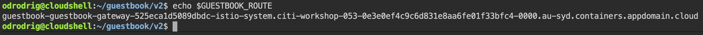

# Exercise 5 - Expose the service mesh with the Istio Ingress Gateway

The components deployed on the service mesh by default are not exposed outside the cluster. External access to individual services so far has been provided by creating an external load balancer or node port on each service.

An Ingress Gateway resource can be created to allow external requests through the Istio Ingress Gateway to the backing services. When using OpenShift Service Mesh, a route is automatically created when a new Istio Gateway is detected.

## Expose the Guestbook app with Ingress Gateway

1. Configure the guestbook default route with the Istio Ingress Gateway. The `guestbook-gateway.yaml` file is in this repository (istio101) in the `docs/plans` directory.

    ```shell
    oc create -f $WORK_DIR/istio101/docs/plans/guestbook-gateway.yaml
    ```

1. Get the OpenShift route that is automatically created.

    ```shell
    GUESTBOOK_ROUTE=$(oc get route -n istio-system  -o=jsonpath='{.items[1].spec.host}')

    echo $GUESTBOOK_ROUTE
    ```

    You should see something like the following:

    

1. You can navigate to your deployed guestbook application by copying the route printed out in the previous command and pasting it in a new browser tab.

Congrats you have exposed your service externally using an Istio Gateway and an OpenShift route. Continue on to see how you can use Istio to manage traffic between two different application versions.

## References

* [Kubernetes Ingress](https://kubernetes.io/docs/concepts/services-networking/ingress/)

* [Istio Ingress](https://istio.io/latest/docs/tasks/traffic-management/ingress/)


## [Continue to Exercise 6 - Traffic Management](../exercise-6/README.md)
